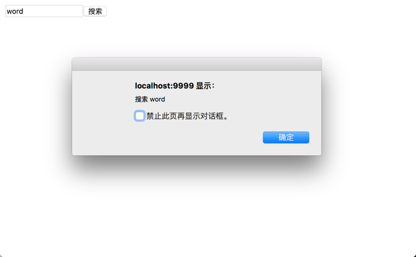

# React 基础知识

## 遍历数组

```{.numberLines}
const names = ['Alice', 'Emily', 'Kate'];
ReactDOM.render(
    <div>
        {
            names.map((item, i) => {
                return <div key={i}>Hello, {item}!</div>
            })
        }
    </div>,
    document.getElementById('container')
);
```


## 组件

React 允许将代码封装成组件 (component), 然后像插入普通 HTML 标签一样, 在网页中插入这个组件.
继承 React.Component 类就用于生成一个组件类.

### 构建组件

下面代码中, 变量 `HelloMessage` 就是一个组件类.
模板插入 `<HelloMessage/>` 时, 会自动生成 `HelloMessage` 的一个实例 (下文的"组件"都指组件类的实例).
所有组件类都必须有自己的 `render` 方法, 用于输出组件.

```{.numberLines}
class HelloMessage extends React.Component {
    render() {
        return <h1>Hello, word!</h1>;
    }
}
ReactDOM.render(
    <HelloMessage/>,
    document.getElementById('container')
);
```

注意, 组件类的第一个字母必须大写, 否则会报错, 比如`HelloMessage`不能写成`helloMessage`.
另外, 组件类只能包含一个顶层标签, 否则也会报错.

```{.numberLines}
class HelloMessage extends React.Component {
    render() {
        return(
            <h1>Hello, word!</h1>
            <p>some text</p>
        );
    }
}
```

上面代码会报错, 因为`HelloMessage`组件包含了两个顶层标签: `h1`和`p`.

### this.props

组件的用法与原生的 HTML 标签完全一致, 可以任意加入属性, 比如 `<HelloMessage  name="John">` , 就是 `HelloMessage` 组件加入一个 `name` 属性, 值为 `John`.
组件的属性可以在组件类的 `this.props` 对象上获取, 比如 `name` 属性就可以通过 `this.props.name` 读取.

```{.numberLines}
class HelloMessage extends React.Component {
    render() {
        return <h1>Hello, {this.props.name}!</h1>;
    }
}
ReactDOM.render(
    <HelloMessage name='word'/>,
    document.getElementById('container')
);
```

组件的属性可以接受任意值, 字符串、对象、函数等等都可以.
有时, 我们需要一种机制, 验证别人使用组件时, 提供的参数是否符合要求.
组件类的`PropTypes`属性, 就是用来验证组件实例的属性是否符合要求.
更多的`PropTypes`设置, 可以查看[官方文档](http://facebook.github.io/react/docs/reusable-components.html).

```{.numberLines}
HelloMessage.propTypes = {
    name: React.PropTypes.string.isRequired
};
```

上面的`Mytitle`组件有一个`title`属性.
`PropTypes` 告诉 React, 这个 `title` 属性是必须的, 而且它的值必须是字符串.
现在, 我们设置 `title` 属性的值是一个数值.

这样一来, `title`属性就通不过验证了.
控制台会显示一行错误信息.

```{.numberLines}
Warning: Failed propType: Required prop `name` was not specified in `HelloMessage`.
```


此外, `defaultProps` 方法可以用来设置组件属性的默认值.

```{.numberLines}
HelloMessage.defaultProps = {
    name: 'world'
};
```

添加组件属性, 有一个地方需要注意, 就是 `class` 属性需要写成 `className` , `for` 属性需要写成 `htmlFor` , 这是因为 `class` 和 `for` 是 JavaScript 的保留字.

### this.props.children

`this.props` 对象的属性与组件的属性一一对应, 但是有一个例外, 就是 `this.props.children` 属性.
它表示组件的所有子节点.

```{.numberLines}
class NotesList extends React.Component {
    render() {
        const { children } = this.props;
        return (
            <ol>
                {
                    children.map((child, i) => {
                        return <li key={i}>{child}</li>
                    })
                }
            </ol>
        )
    }
}
ReactDOM.render(
    <NotesList>
        <span>hello</span>
        <span>world</span>
    </NotesList>,
    document.getElementById('container')
);
```

上面代码的 `NoteList` 组件有两个 `span` 子节点, 它们都可以通过 `this.props.children` 读取, 运行结果如下.


这里需要注意,  `this.props.children` 的值有三种可能:
如果当前组件没有子节点, 它就是 `undefined`;
如果有一个子节点, 数据类型是 `object`;
如果有多个子节点, 数据类型就是 `array`.
所以, 处理 `this.props.children` 的时候要小心.

React 提供一个工具方法 [`React.Children`](https://facebook.github.io/react/docs/top-level-api.html#react.children) 来处理 `this.props.children`.
我们可以用 `React.Children.map` 来遍历子节点, 而不用担心 `this.props.children` 的数据类型是 `undefined` 还是 `object`.
更多的 `React.Children` 的方法, 请参考[官方文档](https://facebook.github.io/react/docs/top-level-api.html#react.children).

### this.refs

组件并不是真实的 DOM 节点, 而是存在于内存之中的一种数据结构, 叫做虚拟 DOM  (virtual DOM).
只有当它插入文档以后, 才会变成真实的 DOM .
根据 React 的设计, 所有的 DOM 变动, 都先在虚拟 DOM 上发生, 然后再将实际发生变动的部分, 反映在真实 DOM 上, 这种算法叫做 [DOM diff](http://calendar.perfplanet.com/2013/diff/), 它可以极大提高网页的性能表现.

但是, 有时需要从组件获取真实 DOM 的节点, 这时就要用到 `ref` 属性.

```{.numberLines}
class SearchBox extends React.Component {
    handleClick() {
        let keyword = this.refs.keyword.value;
        alert(`搜索 ${keyword}`);
    }
    render() {
        return (
            <div>
                <input type="text" ref="keyword"/>
                <button type="button" onClick={this.handleClick.bind(this)}>
                    搜索
                </button>
            </div>
        );
    }
}
ReactDOM.render(
    <SearchBox/>,
    document.getElementById('container')
);
```



上面代码中, 组件 `MyComponent` 的子节点有一个文本输入框, 用于获取用户的输入.
这时就必须获取真实的 DOM 节点, 虚拟 DOM 是拿不到用户输入的.
为了做到这一点, 文本输入框必须有一个 `ref` 属性, 然后 `this.refs.[refName]` 就会返回这个真实的 DOM 节点.

需要注意的是, 由于 `this.refs.[refName]` 属性获取的是真实 DOM , 所以必须等到虚拟 DOM 插入文档以后, 才能使用这个属性, 否则会报错.
上面代码中, 通过为组件指定 `Click` 事件的回调函数, 确保了只有等到真实 DOM 发生 `Click` 事件之后, 才会读取 `this.refs.[refName]` 属性.

React 组件支持很多事件, 除了 `Click` 事件以外, 还有 `KeyDown` 、`Copy`、`Scroll` 等, 完整的事件清单请查看[官方文档](http://facebook.github.io/react/docs/events.html#supported-events).

### this.state

组件免不了要与用户互动, React 的一大创新, 就是将组件看成是一个状态机, 一开始有一个初始状态, 然后用户互动, 导致状态变化, 从而触发重新渲染 UI.

```{.numberLines}
class SearchBox extends React.Component {
    constructor(props) {
        super(props);
        this.state = {
            keyword: ''
        };
    }

    handleClick() {
        let keyword = this.state.keyword;
        alert(`搜索 ${keyword}`);
    }

    handleInputChange(e) {
        this.setState({keyword: e.target.value});
    }

    render() {
        return (
            <div>
                <input type="text" value={this.state.keyword} onChange={this.handleInputChange.bind(this)}/>
                <button type="button" onClick={this.handleClick.bind(this)}>
                    搜索
                </button>
            </div>
        );
    }
}
```

上面代码是一个 `LikeButton` 组件, 它的 `getInitialState` 方法用于定义初始状态, 也就是一个对象, 这个对象可以通过 `this.state` 属性读取.
当用户点击组件, 导致状态变化, `this.setState` 方法就修改状态值, 每次修改以后, 自动调用 `this.render` 方法, 再次渲染组件.

由于 `this.props` 和 `this.state` 都用于描述组件的特性, 可能会产生混淆.
一个简单的区分方法是, `this.props` 表示那些一旦定义, 就不再改变的特性, 而 `this.state` 是会随着用户互动而产生变化的特性.

用户在表单填入的内容, 属于用户跟组件的互动, 所以不能用 `this.props` 读取.
上面代码中, 文本输入框的值, 不能用 `this.props.value` 读取, 而要定义一个 `onChange` 事件的回调函数, 通过 `event.target.value` 读取用户输入的值.
`textarea` 元素、`select`元素、`radio`元素都属于这种情况, 更多介绍请参考[官方文档](http://facebook.github.io/react/docs/forms.html).


